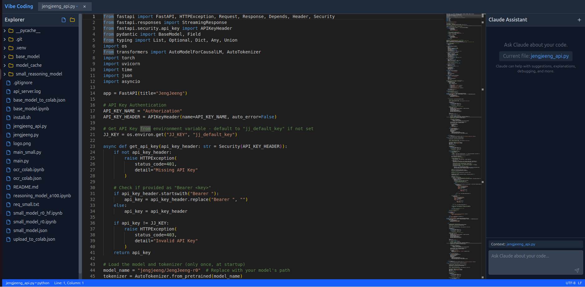

# CodeIterative IDE



**CodeIterative** is a lightweight, efficient code editor inspired by Vim's minimalism but enhanced with AI pair programming capabilities. It combines the speed and responsiveness of minimalist editors with the intelligence of AI assistants like Claude and Qwen.

## Core Philosophy

- **Lean & Fast**: Minimalist interface focused on speed and productivity
- **AI Augmented**: Seamless integration with AI assistants for real-time code help
- **Local-First**: Works with your local files without cloud dependencies
- **Keyboard-Centric**: Optimized for developers who prefer keyboard workflows
- **Context-Aware**: AI assistants understand your code in full context

## Features

### Minimalist Editor
- Fast startup and responsive editing
- Syntax highlighting for multiple languages
- Tabbed interface for efficient multitasking
- Project-based file explorer
- Local file system integration

### AI Pair Programming
- Real-time code assistance from Claude or Qwen
- Context-aware code suggestions
- One-click application of AI suggestions
- Code review and improvement recommendations
- Documentation generation

### Modern Stack
- Built with React, Vite, and Tailwind CSS
- Monaco editor (same engine as VS Code)
- File System Access API for local file handling
- Zustand for lightweight state management

## Getting Started

### Installation

```bash
# Clone the repository
git clone https://github.com/your-username/code-iterative.git

# Navigate to the project directory
cd code-iterative

# Install dependencies
npm install

# Start the development server
npm run dev
```

### Basic Usage

1. **Open the application** in your browser
2. **Click "Open Folder"** to select a project directory
3. **Navigate** through your project files in the explorer
4. **Edit files** in the central editor
5. **Interact with AI** assistants via the right panel:
   - Ask questions about your code
   - Request improvements or optimizations
   - Generate documentation or tests

### AI Integration

#### Claude Setup
1. Enter your Anthropic API key in the Claude panel
2. Start interacting with Claude about your current file

#### Qwen Setup (Coming Soon)
1. Enter your Qwen API credentials
2. Select Qwen from the AI assistant dropdown

## Keyboard Shortcuts

| Shortcut | Action |
|----------|--------|
| `Ctrl+S` | Save file |
| `Ctrl+Tab` | Switch between tabs |
| `Alt+1-9` | Switch to specific tab |
| `Ctrl+O` | Open file |
| `Ctrl+P` | Quick file search |
| `Ctrl+/` | Toggle comment |
| `F1` | Command palette |

## Technology

- **Frontend**: React, Tailwind CSS
- **Build Tool**: Vite
- **Editor**: Monaco Editor
- **State Management**: Zustand
- **File Handling**: File System Access API
- **AI Integration**: Anthropic Claude API, Qwen API (coming soon)

## Philosophy

CodeIterative combines the best of two worlds:

1. **The minimalism and efficiency of Vim** - focusing on speed, keyboard-centric workflows, and minimal resource usage
2. **The intelligence and assistance of modern AI** - leveraging large language models to enhance your coding process

The result is an IDE that stays out of your way but provides intelligent assistance exactly when you need it.

## Contributing

We welcome contributions! Please check our [Contributing Guidelines](CONTRIBUTING.md) for details on how to get started.

## License

[MIT License](LICENSE)

## Roadmap

- [ ] Vim keybindings mode
- [ ] Terminal integration
- [ ] Multiple AI provider support
- [ ] Git integration
- [ ] Custom themes and editor customization
- [ ] Plugin system
- [ ] Offline AI capabilities

---

Built with ❤️ by developers who love both minimalist tools and cutting-edge AI.